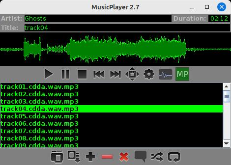

# musicplayer

This is "musicplayer", a 100% Java music player with a UI written in Java Swing. 



Features:
- extremely customizable via Java extension classes
- highly configurable UI with application themes
- full-screen visualizations with many possibilities for extension
- very programmer-friendly if you want to write your own extensions

## The world doesn't need another music playing application!

Agreed. Go download VLC if you want something extremely solid and full-featured.

## So why does this project exist?

I wanted to play music on the tv in my living room, but with interesting and customizable full-screen visualization
so I could just leave it running and have something nice to look at while I do other stuff. With version 2.x, I 
also used musicplayer as a testbed for my own [app-extensions](https://github.com/scorbo2/app-extensions) library 
so I could test out ways to make an application incredibly customizable via dynamically-loaded extensions. I also 
wanted to prove out the `AppProperties` class from `app-extensions` to really demonstrate how to develop an extremely 
customizable application while writing surprisingly little UI code (in the case of the properties dialog, almost 
literally none).

## How do I get it?

The easiest way is to clone the repo, build it with Maven, and run the jar file:

```shell
git clone https://github.com/scorbo2/musicplayer.git
cd musicplayer
mvn package
cd target
java -jar musicplayer-2.1.jar
```

## User guide

- [Customizing the UI](docs/user_guide_ui.md) 
- [Controlling log output](docs/user_guide_logging.md)
- [Controlling where properties live](docs/user_guide_properties.md)

## Developer guide

- [General application design](docs/developer_overview.md)
- [Making use of `swing-extras` for application configuration](docs/developer_properties.md)
- [Making use of `app-extensions` to customize the app](docs/developer_extensions.md)
- [Exercise1: let's write a custom extension!](docs/developer_exercise1.md)
- [Exercise2: let's write a custom visualizer!](docs/developer_exercise2.md)

## License

musicplayer is made available under the MIT license: https://opensource.org/license/mit

## Revision history

Originally written in 2017.  
The 2.0 rewrite happened in March/April 2025.

[Full release notes](src/main/resources/ca/corbett/musicplayer/ReleaseNotes.txt)
