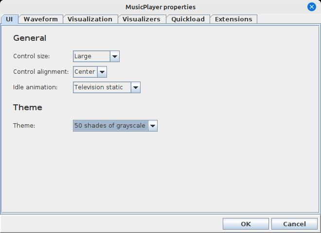

<-- [Back to musicplayer documentation](../README.md)

# Exercise 1: Let's build an extension!

Let's walk through the steps of building a simple extension for the musicplayer app. First, we have to make
sure we have done a maven install so that the app's source code will be available in your local maven rep:

```shell
mvn clean install
```

Now, you can create a new project, and add musicplayer as a dependency:

```xml
<dependencies>
    <dependency>
        <groupId>ca.corbett</groupId>
        <artifactId>musicplayer</artifactId>
        <version>2.6</version>
    </dependency>
</dependencies>
```

(At the time of this writing, 2.6 is the latest available version of the musicplayer code)

Now, we should be able to create our new extension class by extending the `MusicPlayerExtension` base class:

```java
public class TestExtension extends MusicPlayerExtension {
    private static final Logger logger = Logger.getLogger(TestExtension.class.getName());
    private final AppExtensionInfo info;

    public TestExtension() {
        info = new AppExtensionInfo.Builder("Test extension")
                .setTargetAppVersion(Version.VERSION)
                .setTargetAppName(Version.NAME)
                .setAuthor("Steve Corbett")
                .setShortDescription("A quick test extension")
                .setLongDescription("If this shows up, it means the jar was successfully scanned at startup!")
                .setVersion("1.0")
                .build();
    }

    @Override
    public AppExtensionInfo getInfo() {
        return info;
    }

    @Override
    public List<AbstractProperty> getConfigProperties() {
        return List.of(LabelProperty.createLabel("TestExtension.TestExtension.label", "Hello there! This was loaded dynamically!"));
    }

    @Override
    public void onActivate() {
        logger.info("Test extension has been activated! Hello!");
    }

    @Override
    public void onDeactivate() {
        logger.info("Test extension has been deactivated! Goodbye!");
    }
}
```

This extension does not do much, but it will do to verify that the mechanism for loading and using our
extension is in place and working.

## extInfo.json is important!

Your extension must package an `extInfo.json` file somewhere in resources! My recommendation is to create 
a directory structure that should be unique to your extension. For this example, I will place it into
`src/main/resources/ca/corbett/musicplayer/extensions/testextension`, and it looks like this:

```json
{
  "name": "Test extension",
  "version": "1.0",
  "targetAppName": "MusicPlayer",
  "targetAppVersion": "2.6",
  "author": "Steve Corbett",
  "shortDescription": "A quick test extension",
  "longDescription": "If this shows up, it means the jar was successfully scanned at startup!"
}
```

This duplicates the information that our extension returns from the `getInfo()` method. Why is this 
duplication necessary? The `getInfo()` method is invoked by `ExtensionManager` AFTER the extension has
been successfully loaded. The `extInfo.json` file is what tells the `ExtensionManager` whether the
extension in this jar file is compatible with the application code. Pay particularly close attention to
the `targetAppName` and `targetAppVersion` properties in your json, as they will be used as part
of this decision.

## Loading it up

We can do a quick `mvn package` on our project to generate the jar file, which should be quite small as this
is a very simple extension class. We can copy that file to whichever directory we're planning on using as
an extension location. Let's say `~/.MusicPlayer/extensionJars`. Then, we can restart musicplayer and
tell it where to look for extension jars:

```shell
java -Dca.corbett.musicplayer.extensions.dir=/home/scorbett/.MusicPlayer/extensionJars -jar musicplayer-2.6.jar
```

On startup, we should hopefully see some promising log output:

```shell
2025-04-06 08:55:10 P.M. [INFO] Successfully loaded 1 dynamic extensions
2025-04-06 08:55:10 P.M. [INFO] Test extension has been activated! Hello!
2025-04-06 08:55:10 P.M. [INFO] Extension manager initialized with 5 active extensions.
2025-04-06 08:55:10 P.M. [INFO] Visualizer initialized on display 0
2025-04-06 08:55:10 P.M. [INFO] isFullscreenSupported: true
```

Excellent! We see that 1 dynamic extension was loaded. Further, we can see our `Hello!` message that we added
as a log statement to our `onActivate()` method, so we know our extension is not only being loaded, it is in
fact being activated. Finally, we see that there are now 5 active extensions (4 built-in extensions plus
our new test extension). 

If we go to the `PropertiesDialog` in the application, we see that our configuration properties were
also loaded and automatically added to the dialog. Neat! We didn't have to write any UI code at all for this!


Let's go to the `ExtensionManagerDialog` and verify that our extension shows up correctly:


Yup, looks good! Let's hit the checkbox in the top right to disable our extension and hit "OK". When we go back
to the `PropertiesDialog`, we see that our extension's properties have been hidden:



## Okay, now what?

Well, that was fun, but we didn't really accomplish anything useful. Our extension doesn't provide any neat
features or useful abilities, it basically just confirms that it was in fact loaded correctly.

In the next exercise, we'll tackle writing a Visualizer and making sure it gets added to the list of
Visualizers! [Go back to documentation overview](../README.md)
