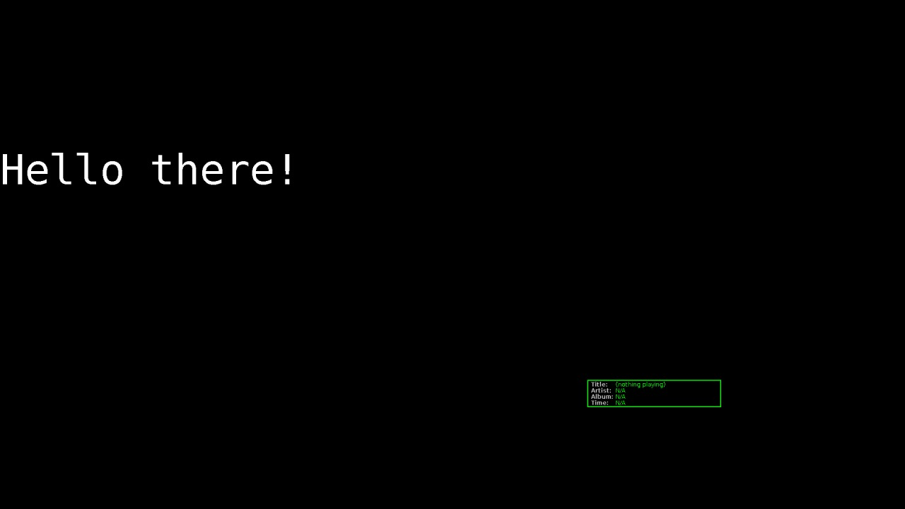

<-- [Back to musicplayer documentation](../README.md)

# Exercise 2: Let's write a custom visualizer!

In the previous exercise, we wrote a very bare-bones extension and verified that we could load it into
the application. That was fun, but it didn't actually do anything. In this exercise, let's write a simple
Visualizer and make sure it actually shows up in our application!

## Extending the Visualizer class

We start by extending the abstract `Visualizer` class:

```java
public class TestVisualizer extends VisualizationManager.Visualizer {
    public TestVisualizer() {
        super("Test Visualizer");
    }

    @Override
    public void initialize(int width, int height) {
    }

    @Override
    public void renderFrame(Graphics2D g, VisualizationTrackInfo trackInfo) {
    }

    @Override
    public void stop() {
    }
}
```

This is the absolute bare-bones implementation of a Visualizer. But we want it to actually do something!
So, let's write some text on the screen and move it around. We'll start by adding class properties
for the text and for its current position and cosmetic properties:

```java
private String text = "Hello there!";
private Color backgroundColor = Color.BLACK;
private Color textColor = Color.WHITE;
private Font font = new Font(Font.MONOSPACED,  Font.PLAIN, 88);
private int x = 0;
private int y = 0;
private int width;
private int height;
```

Our width and height will be supplied to us in the `initialize()` method, so let's make a note of them:

```java
@Override
public void initialize(int width, int height) {
    this.width = width;
    this.height = height;
}
```

Now we just need to render the text and maybe move it each frame:

```java
@Override
public void renderFrame(Graphics2D g, VisualizationTrackInfo trackInfo) {
    g.setColor(backgroundColor);
    g.fillRect(0,0,width,height);
    g.setFont(font);
    g.setColor(textColor);
    g.drawString(text, x, y);
    y++;
    if (y > height) {
        y = 0;
    }
}
```

Okay, pretty basic, but a decent start. Before we can build our jar file, we have to update our
`TestExtension` class to return an instance of our visualizer:

```java
@Override
public List<VisualizationManager.Visualizer> getCustomVisualizers() {
    return List.of(new TestVisualizer());
}
```

Okay, we should be good to go. Let's build our jar file, copy it into place, and start up the application
with it (if you have trouble with this step, refer to exercise 1 where we covered this).

The result:



Okay, not exactly breathtaking, but it works. Notice that we didn't have to do anything in our Visualizer code
to enable the `VisualizerOverlay`, which is the bouncing box with current track information in it. If you don't
want to look at it while testing your visualizer, you can hit "I" to toggle it on and off (i = info).

## Can we customize it? Yes, yes we can!

Everything is hard-coded right now, and hard-coding is bad. Let's add some configuration properties so that
we can change the string to render, the background and text colors, and the font size. We can do this quite easily
in our `TestExtension` class:

```java
@Override
protected List<AbstractProperty> createConfigProperties() {
    List<AbstractProperty> props = new ArrayList<>();
    props.add(new TextProperty("TestExtension.General.text", "Text to render:", "Hello there!", 14, 1));
    props.add(new ColorProperty("TestExtension.General.bgColor", "Background:", ColorProperty.ColorType.SOLID, Color.BLACK));
    props.add(new ColorProperty("TestExtension.General.textColor", "Text color:", ColorProperty.ColorType.SOLID, Color.WHITE));
    props.add(new IntegerProperty("TestExtension.General.fontSize", "Font size:", 88, 8, 120, 2));
    return props;
}
```

That's it! We just have to define the properties and return them. There's no UI code to write! Let's build the
jar, deploy it, and visit the `PropertiesDialog` to verify we can see our new properties:


Wow, looks great! Let's change the background to red and the text color to blue and the font size to something
huge and try it out!


Hey, wait, what happened? Nothing changed! 

## You have to query AppConfig to get your latest property values

Remember that we hard-coded everything in our `Visualizer` class. Adding config properties is great, and it's
amazing how easily we can add them to our common `PropertiesDialog`, but if we never read the values of those
properties, then they aren't wired up to anything and serve no purpose. So, let's revisit our `Visualizer` 
implementation and actually read the values:

```java
@Override
public void renderFrame(Graphics2D g, VisualizationTrackInfo trackInfo) {
    PropertiesManager propsManager = AppConfig.getInstance().getPropertiesManager();
    text = ((TextProperty)propsManager.getProperty("TestExtension.General.text")).getValue();
    backgroundColor = ((ColorProperty)propsManager.getProperty("TestExtension.General.bgColor")).getColor();
    textColor = ((ColorProperty)propsManager.getProperty("TestExtension.General.textColor")).getColor();
    int fontSize = ((IntegerProperty)propsManager.getProperty("TestExtension.General.fontSize")).getValue();
    font = font.deriveFont((float)fontSize);

    g.setColor(backgroundColor);
    g.fillRect(0,0,width,height);
    g.setFont(font);
    g.setColor(textColor);
    g.drawString(text, x, y);
    y++;
    if (y > height) {
        y = 0;
    }
}
```

And the result, after redeploying our latest jar:


There it is! 

You may wonder why every frame, we read the current values from `AppConfig`, set them, and use them. This seems a little
inefficient. Why don't we just note them once in `initialize()` and then we don't need to re-read `AppConfig`
every single time we render a frame? Well, we want to respond to user changes in our properties dialog, don't we?
When the user changes our settings while our visualizer is running, how else would we update ourselves? If only there
was a better, more efficient way to do that!

## A better, more efficient way to respond to properties changes

Let's look at the `UIReloadable` interface:

```java
public interface UIReloadable {
    /**
     * Invoked by ReloadUIAction when it's time to reload the UI.
     * AppConfig should be queried for the latest state of all
     * user-configurable application settings.
     */
    void reloadUI();
}
```

This very simple interface gives us a single method to implement: `reloadUI()`. If we register our
extension class as a `UIReloadable` implementation, we will receive this message whenever our properties
have been changed, and we can respond accordingly. Let's update our extension class:

```java
public class TestVisualizer extends VisualizationManager.Visualizer 
        implements UIReloadable {

    // ...

    public TestVisualizer() {
        super("Test Visualizer");
        ReloadUIAction.getInstance().registerReloadable(this);
    }

    // ...
}
```

In our class declaration, we implement the `UIReloadable` interface. However, that alone won't do anything.
We have to register our class with the `ReloadUIAction` in our constructor, to make it aware of our existence
and tell it to please notify us when our settings change. Now, we can move the properties update code
to our implementation of the `reloadUI()` method:

```java
@Override
public void reloadUI() {
    PropertiesManager propsManager = AppConfig.getInstance().getPropertiesManager();
    text = ((TextProperty)propsManager.getProperty("TestExtension.General.text")).getValue();
    backgroundColor = ((ColorProperty)propsManager.getProperty("TestExtension.General.bgColor")).getColor();
    textColor = ((ColorProperty)propsManager.getProperty("TestExtension.General.textColor")).getColor();
    int fontSize = ((IntegerProperty)propsManager.getProperty("TestExtension.General.fontSize")).getValue();
    font = font.deriveFont((float)fontSize);
}
```

Great! Now this code will only be invoked with the user hits OK on the properties dialog, instead of within
every call to our render() method. This has the side effect of making our render() implementation a lot simpler:

```java
@Override
public void renderFrame(Graphics2D g, VisualizationTrackInfo trackInfo) {
    g.setColor(backgroundColor);
    g.fillRect(0,0,width,height);
    g.setFont(font);
    g.setColor(textColor);
    g.drawString(text, x, y);
    y++;
    if (y > height) {
        y = 0;
    }
}
```

Now our `render()` method only has to worry about doing whatever drawing it needs to do, and it can just use
our class properties for font and style information. These properties will be updated for us, and we can respond
to those changes, even if our visualizer is running when those changes are made! 

## Summary

We've barely scratched the surface of what's possible with the `swing-extras`, library. 
But, we have covered the basics, and we've even created a custom visualizer
that actually works! So, the sky is the limit... go see what you can make!
