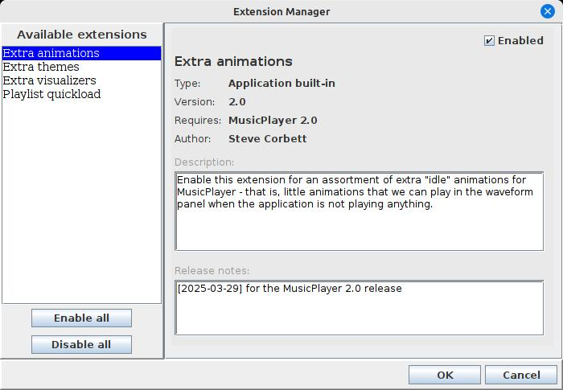

<-- [Back to musicplayer documentation](../README.md)

# Developer overview: Using `app-extensions` to extend the application

The abstract `ExtensionManager` class in the `app-extensions` library is deceptively powerful.
This class can scan a given directory for jar files, and then examine those jar files to see
if they contain an extension class for your application. If so, that class can be loaded dynamically,
and an instance of the extension that it contains can be provided to your application.

We'll need to create two classes to make use of this:
  - an implementation of the `AppExtension` interface
  - an implementation of the abstract `ExtensionManager` class

## Implementing an AppExtension

Let's start by looking at the `AppExtension` interface:

```java
public interface AppExtension {
    public AppExtensionInfo getInfo();
    public List<AbstractProperty> getConfigProperties();
    public void onActivate();
    public void onDeactivate();
}
```

I've omitted the javadocs for brevity. I invite you to look at the full code in the `app-extensions`
library. But basically, it doesn't look like there's much for us to implement here. Where are all
the extension points? 

Well, we have to create them!

But first, we deal with the absolute bare minimum required to create a custom `AppExtension`:

- Implement `getInfo()` to return an `AppExtensionInfo` object describing your extension.
- Implement `getConfigProperties()` to return an optional list of config properties for your extension. (This can be an empty list if your extension doesn't require any).
- Implement `onActivate()` to do whatever prep work (if any) our extension needs before it gets to work.
- Implement `onDeactivate()` to do whatever cleanup (if any) our extension needs before it gets shut down.

That's the bare minimum. But, our extension will not be terribly useful if that's all we do. We need to think about
possible extension points within our application, and write abstract methods here for them.

## Thinking about extension points

With `ExtensionManager`, the important question usually isn't "how can I extend my application", but rather
"in what way(s) can I extend my application". Let's use musicplayer as an example: one obvious extension
point is the fullscreen visualization. I want to be able to write a new Visualizer and have the application
pick it up dynamically, without changing the code of the application itself. How would we do this?

Let's start by defining an abstract `Visualizer` class that our extensions can extend. (This example is
pulled from the actual musicplayer application code, but I'm omitting a bunch of stuff for brevity - I invite
you to look through the actual code for all the nitty gritty details):

```java
public static abstract class Visualizer {

    protected final String name;

    public Visualizer(String name) {
        this.name = name;
    }

    public String getName() {
        return name;
    }

    public abstract void initialize(int width, int height);
    public abstract void renderFrame(Graphics2D g, VisualizationTrackInfo trackInfo);
    public abstract void stop();
}
```

Here we're defining the bare-bones API that an extension Visualizer will have to fulfill. This is the contract
between the musicplayer application code and the extension.

Once we have that abstract class in place, we can add a method to our `MusicPlayerExtension` class:

```java
public abstract class MusicPlayerExtension implements AppExtension {

    // ...
    
    public List<VisualizationManager.Visualizer> getCustomVisualizers() {
        return new ArrayList<>();
    }
}
```

Okay, now our extension has a way to report custom Visualizer implementations to our application. Why return
a `List` instead of just one? Well, why not? The extension could supply more than one Visualizer, after all.

The next step is to add a wrapper method into our `ExtensionManager` implementation:

```java
public class MusicPlayerExtensionManager extends ExtensionManager<MusicPlayerExtension> {
    
    // ...

    public List<VisualizationManager.Visualizer> getCustomVisualizers() {
        List<VisualizationManager.Visualizer> visualizers = new ArrayList<>();

        for (MusicPlayerExtension extension : getEnabledLoadedExtensions()) {
            List<VisualizationManager.Visualizer> list = extension.getCustomVisualizers();
            if (list != null && !list.isEmpty()) {
                visualizers.addAll(list);
            }
        }

        return visualizers;
    }
}
```

This code will go through all enabled and loaded extensions (of course, we want to skip extensions that
are currently disabled - we'll cover that later). For each extension found, we'll ask it for its list
of supplied Visualizers. This list may of course be empty, or even null if our extension class is
careless about it. If we get something back, we'll make it available to the application.

Then, from the point of view of the application code, we're done! The code for the actual Visualizers
will be supplied by the extension dynamically at runtime. Our application code doesn't know the details
of it, and in fact doesn't need to, as long as the extension lives up to the contract we've defined!

## Configuration properties

Your extension may need to expose some configuration properties to be added to the `PropertiesDialog`, so that
the user can set options for it. This is not a problem at all. In fact, this is one of the few methods
that are defined in the `AppExtension` interface:

```java
public List<AbstractProperty> getConfigProperties();
```

We just have to return a list of `AbstractProperty` instances, and the `AppProperties` class, together
with the `PropertiesManager` class, will take care of managing the UI side of it for us.

## Enabling and disabling extensions

Extensions can be enabled or disabled via the `ExtensionManagerDialog`, which is very easy to use. Once again,
we don't need to worry about generating a UI for this or handling the layout of UI components in order 
to present this information to the user. We get this for free with the `app-extensions` library. Basically,
we just need to provide our `ExtensionManager` implementation to an `ExtensionManagerDialog` instance, and
the UI will be generated for us:

```java
ExtensionManagerDialog<T> dialog = new ExtensionManagerDialog<>(extManager, owner);
dialog.setVisible(true);
if (dialog.wasOkayed() && dialog.wasModified()) {
    // save changes, reload the UI, etc
}
```

The result is a user-friendly dialog that contains information about all loaded extensions:



Here, the user can enable or disable extensions. When an extension is disabled, it is no longer queried
for configuration properties, or visualizers, or anything else that it supplies. So, when the UI is
reloaded, it will be as though that extension no longer exists. Until, of course, the user revisits
the `ExtensionManagerDialog` and re-enables it, at which point all of its configuration options and
supplied features will re-appear.

## How are extensions loaded?

The system property `EXTENSIONS_DIR` is checked on startup to see if it
specifies a readable directory. If so, that directory is scanned for compatible jar files. Any that
are found are loaded as viable extensions.

### Specifying the jar directory

Since there is no default value, you have to manually specify the location to be scanned. Let's say we
want to put extension jars in ~/.MusicPlayer/extensionJars :

```shell
java -DEXTENSIONS_DIR=/home/scorbett/.MusicPlayer/extensionJars -jar musicplayer-2.6.jar
```

On startup, we should see some log output describing what happened:

```shell
2025-04-06 08:32:04 P.M. [INFO] Extension manager: found no dynamic extensions in extension dir: /home/scorbett/.MusicPlayer/extensionJars
2025-04-06 08:32:05 P.M. [INFO] Extension manager initialized with 4 active extensions.
2025-04-06 08:32:05 P.M. [INFO] Visualizer initialized on display 0
2025-04-06 08:32:05 P.M. [INFO] isFullscreenSupported: true
```

Okay, it found no extensions in our `extensionJars` directory. So why is it saying it loaded 4 active extensions?
Well, musicplayer comes with some "built-in" extensions, which you can find in the `ca.corbett.musicplayer.extensions.builtin`
package. These are actually good templates you can use when building your own. 

## Okay, so how do I build one?

The next two sections in the developer guide will cover the process of actually writing and testing
a new extension. [Go back to documentation overview](../README.md) to keep reading!
