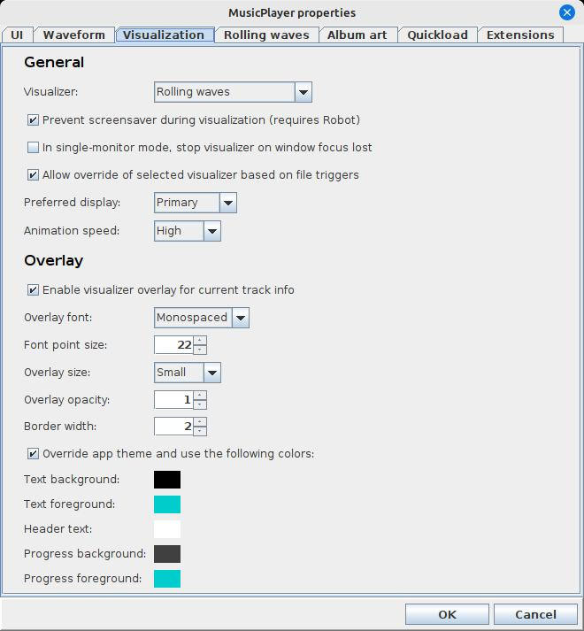

<-- [Back to musicplayer documentation](../README.md)

# Developer overview: general application design

The musicplayer app relies on three of my libraries:

- [swing-forms](https://github.com/scorbo2/swing-forms) - provides a way to very easily generate user input forms in Java Swing.
- [swing-extras](https://github.com/scorbo2/swing-extras) - provides a LOT of neat utilities and custom code I've written in the last 15 years or so.
- [app-extensions](https://github.com/scorbo2/app-extensions) - provides an extension mechanism that allows you to write highly extensible applications.

All of the above are licensed under the [MIT license](https://opensource.org/license/mit), and the code
for each of them is available on github, so I invite you to check them out. In this developer guide, we're going
to be looking pretty closely at `app-extensions`, because it has some really neat capabilities.

Specifically, the `AppProperties` class in `app-extensions` is amazingly useful for saving yourself
a LOT of code. The purpose of this abstract class is to join together a `PropertiesManager` class
(from `swing-extras`) with an `ExtensionManager` class (from `app-extensions`), and have them work
together to make your application MUCH easier to extend and configure. For example, in the user guide
for music player, you probably saw at least one screenshot of the Properties dialog:



It may surprise you to learn that there is almost zero UI code in the musicplayer
app to generate this dialog and to lay out all the form elements. That's right. 
Almost zero. How is this possible?

## PropertiesManager is awesome

The `PropertiesManager` class in the `swing-extras` library is extremely useful. 
It allows you to specify application (or extension) configuration properties by creating
simple `AbstractProperty` instances (using the implementation classes supplied in
`swing-extras`, such as `LabelProperty`, `TextProperty`, `BooleanProperty`, and so on).

Specifying application config properties can be VERY easy:

```java
myProp1 = new EnumProperty<MyEnum1>("UI.General.enum1", "Enum 1:", MyEnum1.VALUE1);
myProp2 = new EnumProperty<MyEnum2>("UI.General.enum2", "Enum 2:", MyEnum2.VALUE2);
```

Here we create a pair of `EnumProperty` instances using a couple of custom enums
in our code. This will, behind the scenes, result in a combo box being generated
for each of these properties. But we don't have to create that combo box! We don't
have to lay it out! We don't have to write code to position it on the form! 
We don't have to write code to generate the possible combo box options based 
on the enum values! Literally all of this is handled for us by `PropertiesManager`
and its assistant class, `PropertiesDialog`. 

## ExtensionManager is awesome

Meanwhile, let's move over to the `app-extension` library, which also has a lot
of very pleasant and powerful surprises. Specifically, we have the abstract
`ExtensionManager` class, which allows us to dynamically scan a directory at
startup, looking for jar files that contain extension classes for our application.
Each extension can supply its own list of configuration properties, which we can
combine together with our own application's properties to generate one unified
`PropertiesDialog` that contains everything. The neat part about this is that
extensions can be enabled and disabled at runtime, and the `PropetiesDialog` 
will automatically reflect those changes, either by hiding configuration 
properties related to now-disabled extensions, or showing configuration properties
related to now-enabled extensions. We don't have to write any of the UI code
to sort that out - we get it for free.

## AppProperties is even awesomer

The `app-extensions` library contains one more class that arguably is the best
part of this whole design: `AppProperties`. This abstract class joins a
`PropertiesManager` together with a custom `ExtensionManager` together into
one package, and links them up so that they are aware of each other.

That allows us to do stuff like this:

```java
myAppProperties.showPropertiesDialog(myMainWindow);
```

Done. That's it. The `AppProperties` instance will take the list of configuration
properties supplied by your `PropertiesManager` and combine that list with the list
of configuration properties supplied by any loaded and enabled extensions found
by your `ExtensionManager`, and boom - you have a fully functional `PropertiesDialog`
generated on the fly for you, with zero UI code on your part.

The musicplayer app makes use of all of the above. 

As we go through this developer guide, we'll take a look at how to use these
features to develop a highly configurable and extensible application, with
musicplayer serving as an example implementation.

