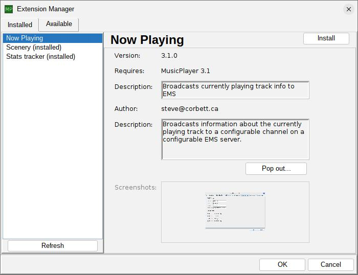

<-- [Back to musicplayer documentation](../README.md)

# User guide: dynamically discovering and installing extensions

**NEW in MusicPlayer 3.0!** The application now includes improvements to the Extension Manager dialog that allows you to
dynamically discover, download, install, update, and remove extensions right from within the
application UI. No more manual cloning, building, and installing required!

The Extension Manager dialog now has an "Available" tab which shows a list of available extensions.
To install an extension, just select it from the list on the left and hit the "Install" button in the top right.
The application will download the extension jar, place it in your extensions directory, and prompt you to restart
the application to complete the installation.

To remove an extension later, just revisit the Extension Manager dialog, select the extension from the "Installed"
tab, and hit the "Uninstall" button in the top right. Again, you'll be prompted to restart the application to complete
the removal.

It's just that easy! Enjoy the new dynamic extension management features in MusicPlayer 3.0!

