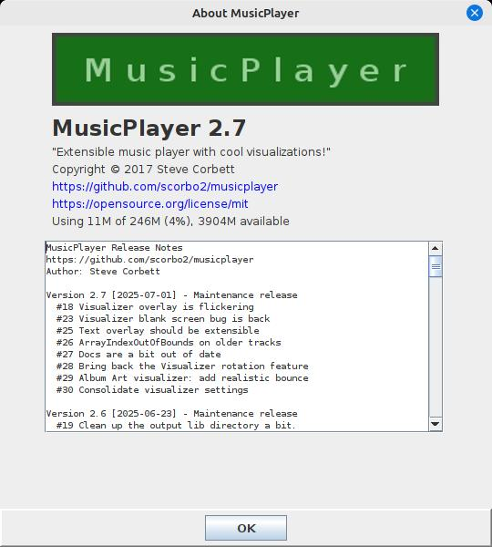

<-- [Back to musicplayer documentation](../README.md)

# User guide: configuring logging

If you started musicplayer using the command line, you probably noticed a few log messages getting generated
to the console:

```shell
$ java -jar musicplayer-2.5.jar 
2025-04-06 03:54:52 P.M. [INFO] Extension manager initialized with 4 active extensions.
2025-04-06 03:54:52 P.M. [INFO] Visualizer initialized on display 0
2025-04-06 03:54:52 P.M. [INFO] isFullscreenSupported: true
2025-04-06 03:54:59 P.M. [INFO] Starting visualization thread
2025-04-06 03:54:59 P.M. [INFO] VisualizationThread created; rendering at 1,920x1,080
```

If you started musicplayer by double-clicking the jar file, however, you probably didn't see any log output.
This is because, by default, log output goes to stdout only (and also to `LogConsole`, which we'll look at later).

The musicplayer application comes with a built-in `logging.properties`, which you can find in the resources
directory. You can, of course, override this by supplying your own. Let's look at a couple of ways to do this.

## Specifying your own logging.properties

Option 1 is to create a `logging.properties` file in whichever directory you are launching the application
from. If this file is detected at startup in the current directory, it will override the one that is built
into the musicplayer jar file.

Option 2 is to explicitly find a home for `logging.properties` and specify it as a system property on startup.
For example, let's say I want to have a `.MusicPlayer` directory in my home directory, and put the logging.properties
file in there. I can modify that `logging.properties` so that the application will write to a log file in
that same directory:

```shell
.level=INFO
handlers=java.util.logging.ConsoleHandler,ca.corbett.extras.logging.LogConsoleHandler,java.util.logging.FileHandler
java.util.logging.SimpleFormatter.format=%1$tF %1$tr [%4$s] %5$s%6$s%n
java.util.logging.FileHandler.pattern=%h/.MusicPlayer/MusicPlayer.log
java.util.logging.FileHandler.formatter=java.util.logging.SimpleFormatter
```

Then, when starting the application, I can specify a value for the `java.util.logging.config.file` system property:

```shell
$ java -Djava.util.logging.config.file=/home/scorbett/.MusicPlayer/logging.properties -jar musicplayer-2.5.jar
```

Great! Now I can see my log file get created every time I start up the application, so if something bad happens,
I can check it to see what went wrong.

## Using LogConsole

My `swing-extras` library (which musicplayer uses) includes a component called `LogConsole`. This provides a nice
way of viewing log information easily at runtime without having to go dig up the log file in whatever directory
you put it. The `LogConsole` also works even if you are not directing log output to a file, because it uses
its own log handler called `ca.corbett.extras.logging.LogConsoleHandler`.

To access the log console, hit ctrl+a to bring up the "About" dialog, or click on the toolbar button
with the MusicPlayer logo on it. This brings up the About dialog:



The MusicPlayer logo image is clickable! Give it a click and you will see the `LogConsole` appear. You can 
summon it this way at any time, or just leave it up. It will update itself whenever new log information appears.


