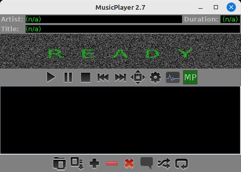
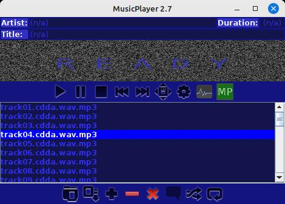
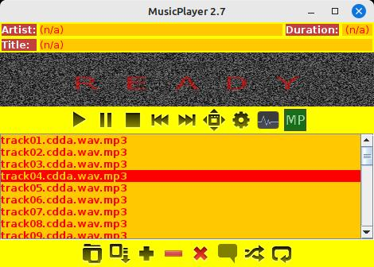

<-- [Back to musicplayer documentation](../README.md)

# User guide: customizing the UI

When you start musicplayer for the first time, you'll see that many UI preferences have been set to
reasonable default values for you. The default theme is "Matrix", which has a green-on-black
color scheme:

But almost everything you see can be changed! Let's take a quick look at the Preferences dialog,
either by hitting ctrl+p on the keyboard, or clicking the gear icon on the player toolbar.

Here we have some options for picking the size of our toolbar buttons, their alignment
within their respective panels, and also the "idle animation" - this is a little animation
that plays in the audio waveform panel whenever there is no audio data loaded. In the screenshot
above, you can see the "television static" animation, which displays a grayscale static animation.

Here, we also have the option of selecting an application theme. You can see that `Matrix` is already
selected, but if we try out the different values, we can see some neat results:

 
 

Other than the boring "standard" theme, all of these options are coming from an application
extension. We'll talk a lot more about application extensions in the developer guide. But for now,
you can play with these options and find one you like.

## Configuring the waveform display

When audio is loaded, a waveform image is generated and displayed in the audio panel. By default,
the application will use the color scheme from the currently selected application theme when
generating the audio waveform. For example, with the `Matrix` theme, the audio waveform panel
will look something like this:

But this is highly customizable! Let's go back to the Preferences dialog and look at the `Waveform` tab:

You can see that here, we have the option to override the current application theme and specify our
own color scheme for the waveform image. When we try this, we can generate one with a little more style to it:

## Configuring full-screen visualization

One of the main reasons why musicplayer exists in the first place is for the full-screen visualization
capabilities. This allows you to set up musicplayer on a dedicated monitor or tv screen and have it play
constantly in the background, with some customizable visualization being displayed.

Let's go back to the Preferences dialog and look at the Visualization tab:

We can see that there are quite a few general options we can set here. Let's look at some of these:

- **Prevent screensaver during visualization**: this will use java.awt.Robot (if supported in your JRE) to wiggle the mouse every now and then during visualization to prevent the screensaver from clicking on. Disable it here if you don't want your mouse jiggled.
- **In single-monitor mode, stop visualizer on window focus lost**: if you're on a machine with only one monitor, it's sometimes nice to have the visualizer automatically stop when you alt+tab to do something else.
- **Allow override of selected visualizer based on file triggers**: Some visualizers (for example, the Album Art visualizer) can interrupt the current visualizer if certain conditions are met. For example, the Album Art visualizer can commandeer the visualizer window if the application starts playing a track that has a track image or an album image. Deselect this option if you want to force musicplayer to always use the visualizer you've picked on this tab.
- **Preferred display**: on multi-monitor setups, you can choose which display will be used for full-screen visualization.
- **Animation speed**: you can speed up the animation thread at the expense of more cpu usage, or tone it down if your visualizer doesn't need crazy high frame rates.

Here we can also customize the "overlay". This is an optional bouncing box that contains information about the currently
playing track. This box can be rendered according to whatever color scheme is selected in the current application theme.
Or, you can override it here with your own preferred settings.

Put it all together, and when you hit "V" to start visualization (or hit the visualization toolbar button), you should
get something like this:

### Further options for "rolling waves"

The Rolling Waves visualizer pictured above was actually the very first visualizer I wrote for MusicPlayer 1.0 back
in 2017. It gets its own tab on the Preferences dialog so you can customize it a bit further:

Here we can set some options regarding the wave size and direction, and of course the color gradient that it 
uses. Personally, I quite like blue to black, but whatever works for you.

### Using the album art visualizer

The Album Art visualizer is one of the visualizers that can "override" the currently selected visualizer
when certain conditions are met. The lyrics sheet visualizer and the commentary visualizer also do this,
but Album Art is a pretty good example of how this works.

In the Preferences dialog, we can take a look at the Album Art tab to see what options we have:

Basically, this visualizer looks for an `album.png` or `album.jpg` in the same directory as the currently
playing track. If not found, it will look for an image with the same base filename as the currently playing
track. For example, if the current track is `track01.mp3`, then the visualizer will look for `track01.jpg`
or `track01.png`. If both a track image and an album image are present, the track image (the more specific
one) will be used. If both a png and a jpg are present, the png will be used (because it's lossless).
If neither are found, then the visualizer will simply display a black screen.

But! There's a nicer way to use this visualizer, and that is to NOT select it as the current visualizer
on the Visualizer tab. Just make sure `allow override of selected visualizer` is selected, and you can
stick with Rolling Waves or whatever you like as your primary visualizer. Whenever the current track changes
to play the next track, the Album Art visualizer will quickly check to see if it needs to step in, and 
if a track or album image is present, it will automatically override the selected visualizer and activate
itself. If the subsequent track does not have a track or album image, then the Album Art visualizer will
yield to whichever other visualizer was selected as the current visualizer. Pretty neat!

## Writing your own!

Yes! It's not only possible, it's actually quite easy to add your own extensions to musicplayer.
In the developer guide, we'll cover how to:

- Write a custom idle animation
- Create your own custom application theme
- Write your own visualizer!
- Write other custom extensions to do almost anything you like.
